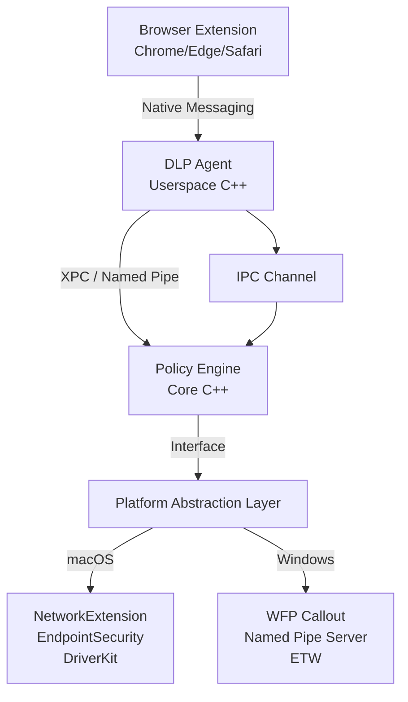
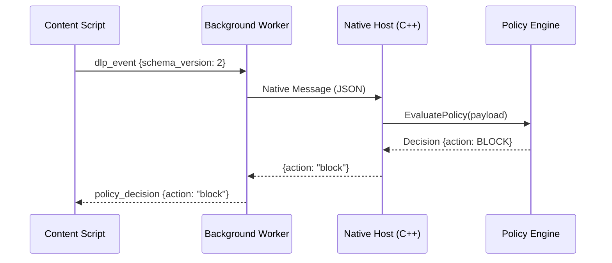

# Codebase Onboarding

**Scope:** `$scope`
**Focus:** `$focus`

Run once when onboarding new engineers or after significant architectural change.
Intentionally thorough — not for regular sessions.

## Behavioural Rules

- **Ask first**: If the build system, platform targets, or entry points are
  ambiguous after initial scan, ask the user before proceeding.
- **CLAUDE.md updates**: After producing CODEBASE.md, check CLAUDE.md for gaps
  in the Codebase Overview section. Propose additions and ask for confirmation
  before writing anything (project root CLAUDE.md, not ~/.claude/CLAUDE.md).

---

## Phase 1: Discovery

```bash
find $scope -type f \( -name "*.cpp" -o -name "*.h" -o -name "*.c" \
  -o -name "*.mm" -o -name "*.swift" -o -name "*.ts" -o -name "*.js" \) \
  | head -200

ls CMakeLists.txt Makefile Package.swift *.xcodeproj *.sln 2>/dev/null

grep -r "int main\|WinMain\|DllMain\|DriverEntry\|applicationDidFinishLaunching" \
  $scope --include="*.cpp" --include="*.c" --include="*.mm" -l

find $scope -name "*_win.*" -o -name "*_mac.*" -o -name "*_posix.*" | head -50

grep -r "xpc_connection\|CreateNamedPipe\|NEFilterDataProvider\
  \|es_new_client\|FwpsCalloutRegister" $scope \
  --include="*.cpp" --include="*.c" --include="*.mm" --include="*.swift" -l
```

---

## Phase 2: Deep Analysis

For each major module, read key headers and up to 2 representative source files.
Determine:

1. **Purpose** — one sentence
2. **Inputs** — IPC messages, OS events, file paths, etc.
3. **Outputs** — policy decisions, logs, blocked events, etc.
4. **Dependencies** — which other modules does it depend on
5. **Platform scope** — Windows / macOS / both / cross-platform
6. **Key entry points** — 2–5 most important classes or functions

If a module's purpose is unclear, note it as "Unclear — needs author input"
rather than guessing.

---

## Phase 3: Produce CODEBASE.md

Write `CODEBASE.md` at the repo root (or `$scope`):

```markdown
# Codebase Reference

> Generated by /codebase-onboarding on <date>
> Re-run after significant architectural changes.

---

## Architecture Overview

3–5 sentence description of what this codebase does and its approach.

---

## Architecture Diagram



<!-- Customise to match what was discovered in Phase 1 & 2 -->

---

## Module Reference

### `<ModuleName>` — `<path/to/module/>`

**Platform**: Windows / macOS / Both
**Purpose**: One sentence.
**Inputs**: list
**Outputs**: list
**Key entry points**:
- `ClassName::method()` — description
**Dependencies**: `OtherModule`
**Notes**: Gotchas or things a new engineer must know.

---

## Data Flow: <Scenario Name>



---

## Build System

- **Build tool**: CMake / Xcode / MSBuild
- **How to build**: `<command>`
- **How to run tests**: `<command>`
- **Key build flags**: list

---

## Platform File Conventions

| Suffix | Platform | Example |
|---|---|---|
| `_win.cpp` | Windows only | `FileMonitor_win.cpp` |
| `_mac.mm` | macOS only (ObjC++) | `FileMonitor_mac.mm` |
| `_mac.cpp` | macOS only (C++) | `XpcChannel_mac.cpp` |
| (no suffix) | Cross-platform | `PolicyEngine.cpp` |

---

## Glossary

| Term | Meaning |
|---|---|
| DLP | Data Loss Prevention |
| WFP | Windows Filtering Platform |
| ESF | EndpointSecurity Framework (macOS) |
| IPC | Inter-Process Communication |
```

---

## Phase 4: Update CLAUDE.md

Check the `## Codebase Overview` section of `CLAUDE.md`.
For each item not already present, propose adding it and ask for confirmation:
- Overall codebase purpose (1–2 sentences)
- Major subsystems with one-line descriptions
- Platform file naming convention (if not documented)
- Build command
- Project-specific conventions discovered

Only write after user confirms. Never overwrite existing content — append only.

---

## Sequential Thinking Integration

After installation, invoke by asking Claude to "think through this problem step by step"
or "use sequential thinking to analyze this architecture."

Especially useful for:
- Tracing data flows across multiple modules
- Resolving ambiguous module ownership
- Determining correct layer assignment for discovered code
